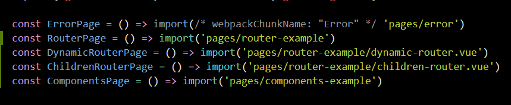
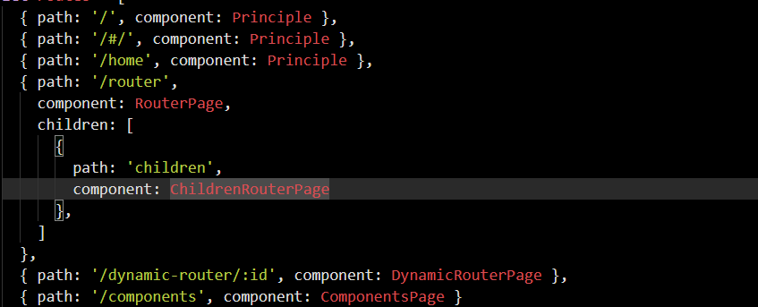

## Vue-router

:::demo

```html
<div>
  <div></div>
  <div></div>
  <router-link to="/router">
    完整的路由例子
  </router-link>
</div>
```
:::

### 基础用法
:::demo 在router.js定义路由

```html
<div>
  <div>
    <router-link to="/components">
      组件例子展示页
    </router-link>
  </div>
</div>

<script>
  export default {
    data() {
      return {
      }
    },
    methods: {
    }
  }
</script>
```
:::

### 动态路由
:::demo 在router.js通过冒号定义路由，即可传参数的路由

```html
<div>
  <router-link to="/dynamic-router/123456">
    动态路由例子展示页
  </router-link>
</div>

<script>
  export default {
    data() {
      return {
      }
    },
    methods: {
    }
  }
</script>
```
:::

### 子路由/嵌套路由
:::demo 在router.js通过children定义子路由

```html
<div>
  <router-link to="/router/children">
    子路由例子展示页
  </router-link>
</div>

<script>
  export default {
    data() {
      return {
      }
    },
    methods: {
    }
  }
</script>
```
:::

### 编程式的导航 router.push

:::demo 即通过js跳转路由

```html
<div>
  <a style="cursor: pointer" @click="routerClick">
    通过js跳转路由
  </a>
</div>

<script>
  export default {
    data() {
      return {
      }
    },
    methods: {
      routerClick() {
        this.$router.push('/dynamic-router/888888');
      }
    }
  }
</script>
```
:::

